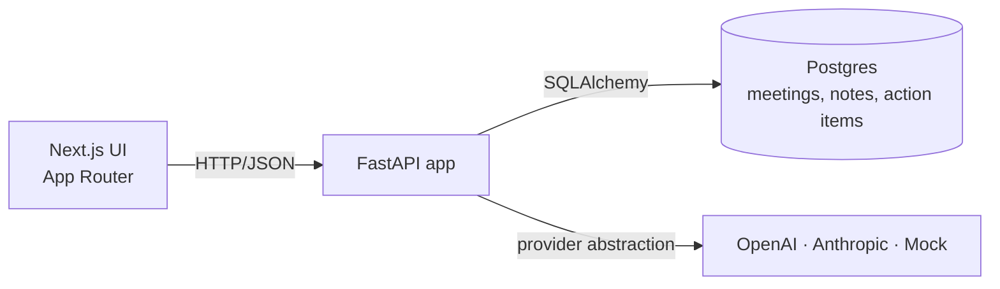

# AI Meeting Notes & Action Tracker

Turn raw meeting transcripts into structured notes: executive summary, key
decisions, action items (with owners and due dates), and unresolved questions.
Track follow-ups, export to Markdown, and ship the whole stack with a single
`docker compose up`.

The stack runs end-to-end **without an API key** thanks to a built-in mock
AI provider. Set `USE_MOCK_AI=false` and supply an `OPENAI_API_KEY` or
`ANTHROPIC_API_KEY` to switch providers; nothing else changes.

<p>
  
  
  
  
  
  
</p>

---

## Screenshots

Captures live in `docs/screenshots/`. Drop new ones in and the tables below
update automatically.

| Dashboard | Meeting detail |
| --- | --- |
|  |  |

| New meeting | Action items |
| --- | --- |
|  |  |

Recommended capture flow:

1. `bash scripts/seed.sh` to load the three sample meetings
2. Capture dashboard, meeting detail (AI notes tab open), the new-meeting page, and the action items view
3. Toggle dark mode in the top nav for one variant

---

## Why this project

Meetings are where decisions get made, but the notes rarely survive the
meeting. The hard part of automating that pipeline isn't transcription —
it's turning unstructured conversation into a small, typed object you can
actually act on: decisions, action items, owners, dates, follow-ups.

This repo implements that pipeline end to end:

- **Parsing** — speaker-labeled or chat-style transcripts, normalized into sentences.
- **Extraction** — heuristics or an LLM produce typed `GeneratedNotes`:
  summary, decisions, owners, due dates, unresolved questions.
- **Persistence** — a relational model (`Meeting → MeetingNotes (1:1) → ActionItem (1:N)`)
  with cascade deletes and a `draft → processing → ready/failed` status machine.
- **Surface** — sidebar dashboard with KPI cards, optimistic action-item updates,
  full-text search, Markdown export, light/dark mode.

Mock-AI mode is a deliberate design choice: the full product — extraction,
action tracking, Markdown export — works without external dependencies, so
the project clones cleanly and runs with a single command.

---

## Technical highlights

| Area | What's done | Why it matters |
| --- | --- | --- |
| Architecture | Layered backend: thin routes, service layer, repository layer, provider layer. | Routes never touch SQLAlchemy or a vendor SDK. Services are reusable in tests, scripts, and future workers. |
| Provider abstraction | `LLMService` picks `mock`, `openai`, or `anthropic` from settings at request time. Each provider validates output against `GeneratedNotes` via Pydantic. | Swapping providers is one env var. Drift in model output surfaces as a typed `AIProviderError`, not a `KeyError` in a route. |
| Status machine | `draft → processing → ready/failed`, enforced on the server. Re-running generation replaces action items rather than appending. | Notes stay in sync with the most recent model output; clients can't drive the workflow into invalid states. |
| Error contract | Domain exceptions are mapped to a typed `{error: {code, message, details}}` body via a single FastAPI exception handler. | Frontend branches on `error.code`. No 500s leak stack traces. |
| Observability | `structlog` plus a request-id middleware. Every log line carries request id, method, path, status, duration. | Logs correlate to a single request without a tracing dependency. |
| Testing | Pytest fixtures swap Postgres for SQLite. The suite covers mock extraction quality, end-to-end API flows, status transitions, and Markdown export. | The whole suite runs in CI with zero external services. |
| Frontend | shadcn/ui primitives, lucide icons, Tailwind tokens for light + dark via CSS variables, optimistic SWR mutations, toast feedback. | Looks like a product, not a prototype. |
| Mock extractor | Sentence splitter, cue-phrase matchers ("we decided", "action item", "owner:"), relative-date parser ("by Friday", "EOD", "next week"). | The mock isn't a placeholder — it produces realistic structured output so the UI feels real on first launch. |

---

## Architecture



Three deployable units — frontend, backend, database — orchestrated with
`docker compose`. The backend owns the API contract; the frontend is a thin
client.

```
backend/app/
  core/           settings, structlog, error envelope, request-id middleware
  api/routes/     thin HTTP adapters (meetings, action-items, health)
  schemas/        Pydantic request/response models
  models/         SQLAlchemy ORM (Meeting, MeetingNotes, ActionItem)
  repositories/   DB access only (no business rules)
  services/       business logic: meetings, notes generation, mock AI,
                  provider-abstracted LLM, Markdown export
  db/             engine, session, declarative base
```

Sequence diagrams for the generate-notes flow, plus the design trade-offs
and a "what would change at scale" note, are in
[`docs/architecture.md`](docs/architecture.md).

---

## Demo flow

```bash
# 1. Boot the stack.
cp .env.example .env
docker compose up --build

# 2. In a second terminal — create and generate notes for three sample meetings.
bash scripts/seed.sh
```

Then in the browser:

1. **Dashboard** (http://localhost:3000) — KPI cards populate with total
   meetings, open and completed action items, and the notes-generated rate.
2. **Open a meeting** — *Q3 Launch Planning* is a good start. The AI Notes tab
   shows the executive summary with a confidence bar, key decisions, an
   unresolved question, and action items with detected owners and due dates.
3. **Track an action item** — tick the checkbox or use the dropdown to move
   it through `Open → In progress → Completed`. The dashboard counters
   update on the next visit.
4. **Create a meeting** — *New meeting*. Paste a transcript or use the bundled
   sample button; "Generate notes after saving" is on by default.
5. **Export Markdown** — *Export Markdown* in the top right on any meeting
   with notes.
6. **Flip to a live model** *(optional)* — stop the backend, set
   `USE_MOCK_AI=false` and one of `OPENAI_API_KEY=…` / `ANTHROPIC_API_KEY=…`
   in `backend/.env`, restart. The top-nav badge swaps Mock to Live and
   answers come from the model.

---

## Local setup

### Option A — Docker (recommended)

```bash
cp .env.example .env             # tweak ports if needed
docker compose up --build
```

| Service   | URL                              |
| --------- | -------------------------------- |
| Frontend  | http://localhost:3000            |
| Backend   | http://localhost:8000            |
| API docs  | http://localhost:8000/docs       |
| Postgres  | localhost:5432                   |

### Option B — Run services manually

Requires Python 3.12 and Node 20+.

```bash
# 1. Postgres (or set DATABASE_URL=sqlite:///./dev.db in backend/.env)
docker run --name meetings-pg -p 5432:5432 \
  -e POSTGRES_USER=meetings -e POSTGRES_PASSWORD=meetings -e POSTGRES_DB=meeting_notes \
  -d postgres:16-alpine

# 2. Backend
cd backend
cp .env.example .env
python3.12 -m venv .venv && source .venv/bin/activate
pip install -r requirements.txt
uvicorn app.main:app --reload --port 8000

# 3. Frontend (new terminal)
cd frontend
cp .env.example .env.local
npm install
npm run dev
```

---

## API overview

All endpoints are documented interactively at http://localhost:8000/docs
(OpenAPI / Swagger) and http://localhost:8000/redoc.

| Method | Path                              | Description                                  |
| ------ | --------------------------------- | -------------------------------------------- |
| GET    | `/health`                         | Health check + mock-mode indicator           |
| POST   | `/meetings`                       | Create a meeting (with optional transcript)  |
| GET    | `/meetings`                       | List meetings (optional `?search=`)          |
| GET    | `/meetings/{id}`                  | Get one meeting with notes + actions         |
| PATCH  | `/meetings/{id}`                  | Update title / participants / transcript     |
| DELETE | `/meetings/{id}`                  | Delete meeting + cascade                     |
| POST   | `/meetings/{id}/generate-notes`   | Run AI generation; replaces action items     |
| GET    | `/meetings/{id}/export`           | Return rendered Markdown                     |
| PATCH  | `/action-items/{id}`              | Update status / description / owner          |

Every response carries an `X-Request-ID` header that matches the structured
log line for that request.

### Sample `generate-notes` response

```json
{
  "id": "…",
  "title": "Q3 Launch Planning",
  "status": "ready",
  "notes": {
    "executive_summary": "The team finalised the Q3 launch plan for the new billing dashboard…",
    "key_decisions": ["Ship on July 15", "Keep legacy export endpoint until Q4"],
    "unresolved_questions": ["How to handle EU pricing for enterprise tier"],
    "suggested_follow_up": "Confirm owners and dates for 4 action items.",
    "confidence": 0.78,
    "used_mock": true,
    "model_name": "mock"
  },
  "action_items": [
    { "description": "Marc will draft the launch announcement by next Monday",
      "owner": "Marc", "due_date": "2026-06-01T17:00:00Z", "status": "open" },
    { "description": "Sam will investigate the EU pricing question",
      "owner": "Sam", "due_date": "2026-05-29T17:00:00Z", "status": "open" }
  ]
}
```

### Error envelope

```json
{
  "error": {
    "code": "ai_provider_error",
    "message": "Model output did not match the GeneratedNotes schema.",
    "details": { "raw_response": "…" }
  }
}
```

---

## Environment variables

Backend (`backend/.env`, template at `backend/.env.example`):

| Variable             | Default                                | Description                                  |
| -------------------- | -------------------------------------- | -------------------------------------------- |
| `DATABASE_URL`       | `postgresql+psycopg2://…`              | SQLAlchemy URL (Postgres or SQLite)          |
| `USE_MOCK_AI`        | `true`                                 | Force mock provider regardless of keys       |
| `AI_PROVIDER`        | `openai`                               | `openai` or `anthropic`                      |
| `OPENAI_API_KEY`     | *empty*                                | Required when `AI_PROVIDER=openai`           |
| `OPENAI_MODEL`       | `gpt-4o-mini`                          |                                              |
| `ANTHROPIC_API_KEY`  | *empty*                                | Required when `AI_PROVIDER=anthropic`        |
| `ANTHROPIC_MODEL`    | `claude-sonnet-4-6`                    |                                              |
| `CORS_ORIGINS`       | `http://localhost:3000`                | Comma-separated                              |
| `LOG_LEVEL`          | `INFO`                                 | structlog level                              |

Frontend reads `NEXT_PUBLIC_API_BASE_URL` (default `http://localhost:8000`).

---

## Tests

Backend tests use SQLite — no external services required.

```bash
cd backend
pytest -q
```

Frontend type-check:

```bash
cd frontend
npm run typecheck
```

GitHub Actions runs the backend suite on every push and PR
(`.github/workflows/backend-tests.yml`).

---

## Project structure

```
ai-meeting-notes-action-tracker/
├── backend/                 FastAPI service
│   ├── app/
│   │   ├── api/routes/            meetings, action_items, health
│   │   ├── core/                  config, logging, errors
│   │   ├── db/                    engine, session, base
│   │   ├── models/                SQLAlchemy ORM
│   │   ├── repositories/          DB access
│   │   ├── schemas/               Pydantic schemas
│   │   ├── services/              business logic + provider abstraction
│   │   └── main.py
│   ├── tests/                     pytest suite
│   ├── Dockerfile
│   └── requirements.txt
├── frontend/                Next.js 15 App Router
│   ├── app/                       dashboard, meetings, new, [id], action-items
│   ├── components/                ui/ (shadcn), layout/, panels/
│   ├── hooks/
│   ├── lib/                       api client, types, utils
│   ├── tests/
│   └── Dockerfile
├── sample-transcripts/      Three realistic transcripts used by seed.sh
├── scripts/seed.sh          Create + generate notes for the three samples
├── docs/architecture.md     Sequence diagrams, domain model, trade-offs
├── docker-compose.yml
└── .github/workflows/backend-tests.yml
```

---

## Future improvements

Out of scope for v1 but the natural next steps:

- Async generation with a job queue (Celery / RQ) and a websocket update for the UI
- Streaming JSON output for very long transcripts
- Speaker-diarization-aware chunking for transcripts that exceed the context window
- Authentication and multi-tenant workspaces with per-workspace API keys
- Alembic migrations in place of `create_all`
- OpenTelemetry tracing and Prometheus metrics
- Edit-after-generate flow so notes can be reviewed before they're treated as ground truth
- Notion / Confluence / Linear integrations for one-click sync of action items
- Bulk import of past transcripts from Zoom, Granola, Otter, etc.

---

## License

MIT — see [`LICENSE`](LICENSE).
