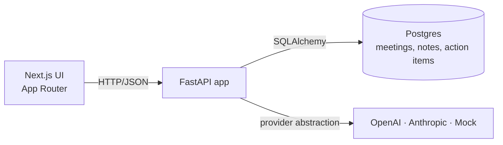
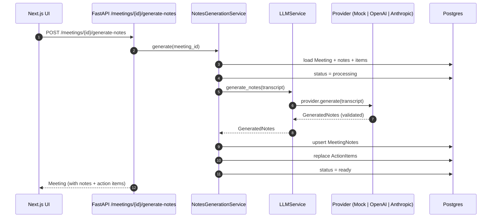

# Architecture

## High level



Three deployable units: frontend (Next.js), backend (FastAPI), database
(Postgres). Everything ships in `docker-compose.yml` and runs out-of-the-box
in mock mode — no API keys required.

## Backend layering

The backend follows a strict layered architecture so the LLM integration can
swap providers without leaking into the API surface or storage layer.

```
backend/app/
  core/           → settings, structlog, error handling
  api/routes/     → thin HTTP adapters (meetings, action-items, health)
  schemas/        → Pydantic request/response models
  models/         → SQLAlchemy ORM models
  db/             → engine + session
  repositories/   → data access only
  services/       → business logic, orchestration
    llm_service   → provider-abstracted notes generation
    mock_ai_service
    meeting_service
    notes_generation_service
    action_item_service
    markdown_export_service
```

- **Routes** parse the request, call a service, return a Pydantic schema.
- **Services** own business logic: status transitions, mock-mode fallback,
  drafting → persistence.
- **Repositories** are the only place SQL lives.
- **LLM service** picks a provider from settings and produces a validated
  `GeneratedNotes`. The route never knows which provider answered.

## Domain model

```
Meeting (id, title, participants, transcript, status, error_message, …)
  ├── MeetingNotes (1:1)   ← auto-generated summary, decisions, questions, …
  └── ActionItem (1:N)     ← description, owner, due_date, status
```

Each meeting has a status that moves through `draft → processing → ready/failed`.
Notes and action items are owned by the meeting (`ON DELETE CASCADE`).
Re-running generation **replaces** action items rather than appending — this
keeps the structured output in sync with whatever the model produced most
recently.

## Request flow: generate notes



## LLM provider abstraction

`LLMService` is the entry point. It owns three responsibilities:

1. Decide whether to use the mock provider — forced via `USE_MOCK_AI=true`
   *or* when the selected provider has no key configured.
2. Construct the right provider object lazily (imports happen inside the
   provider class so mock mode pulls in zero SDK code).
3. Validate the response with `GeneratedNotes` so downstream layers see a
   typed object regardless of which model produced it.

```
┌──────────────────────┐
│      LLMService      │
│  generate_notes(...) │
└──────────┬───────────┘
           │
   ┌───────┼──────────────────────────────┐
   │       │                              │
   ▼       ▼                              ▼
 Mock    OpenAIProvider           AnthropicProvider
        (chat completions)        (messages API)
```

The two real providers both ask the model to return a single JSON object that
matches the `GeneratedNotes` schema. The response is parsed and validated
through Pydantic — any drift raises an `AIProviderError` with the offending
payload attached, so the failure surfaces cleanly through the centralised
error handler.

## Mock provider — why it matters

The mock provider is intentionally **not a stub**. It runs a small set of
heuristics over the transcript:

- splits into sentences with a sane regex
- extracts decisions on cues like _"we decided / agreed / will"_
- extracts action items on _"action item / will send / by Friday / owner: X"_
- pulls owners from `Name:` speaker labels or explicit `owner: Name`
- parses dates: `Monday/.../Sunday`, `tomorrow`, `EOD`, `next week`, `end of month`
- dedupes and bounds confidence based on signal density

That makes the full product testable and demoable end-to-end without spending
a single token, and gives reviewers (or interviewers) a working experience on
first launch.

## Data flow: action items

Action items are first-class — they have their own table, REST endpoint, and
status enum. The frontend updates them with `PATCH /action-items/{id}` and
the dashboard / detail / action-items pages all update via SWR's optimistic
mutate so the UI stays snappy.

When a meeting is regenerated, the service drops the existing items and
recreates them from the new model output. This is intentional: the most
recent generation is the source of truth, and ORM cascade deletes keep the
table clean.

## Markdown export

`markdown_export_service` is a pure function over the domain objects, so it
is trivially testable and easy to plug into a future "download as PDF /
share" feature. The export covers:

- Meeting metadata
- Executive summary
- Key decisions (bullets)
- Action items (GitHub-style checkboxes, owners, due dates)
- Unresolved questions
- Suggested follow-up
- A confidence + provider footer
- The raw transcript (fenced)

## Trade-offs

- **Synchronous generation.** `POST /generate-notes` blocks until the model
  responds. Fine for portfolio demos and short transcripts; an async job
  queue would be the next step for production.
- **`create_all` instead of Alembic.** Zero-friction setup beats migration
  ceremony at this stage. Alembic is the obvious upgrade once the schema
  evolves.
- **No auth or multi-tenancy.** This is a single-workspace tool; a
  workspace-scoped data model + auth would be required for shared
  deployments.
- **One-shot JSON output.** The model is asked for a full JSON object in a
  single response. Streaming structured output (e.g. JSON Lines per action
  item) would improve perceived latency on long transcripts.

## What would change at scale

- Background worker for transcript ingestion (Celery or RQ) so the API
  returns immediately and the UI polls or subscribes to updates.
- Per-tenant API keys and rate limiting; provider keys held in a secret
  manager instead of env vars.
- Diarization-aware chunking for very long transcripts (>50k tokens), with a
  map-reduce style summarisation.
- Audit log of every generation, including the prompt, model, and raw
  response, for traceability.
- Optional human-in-the-loop edit step on notes before they become the
  "source of truth".
